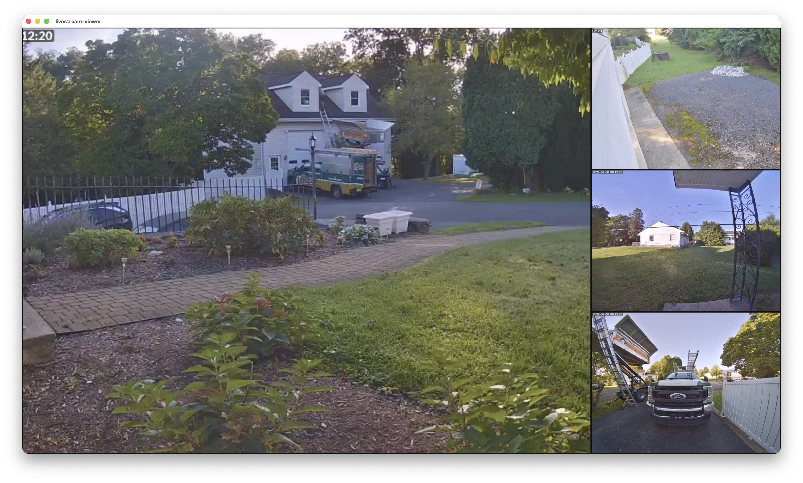
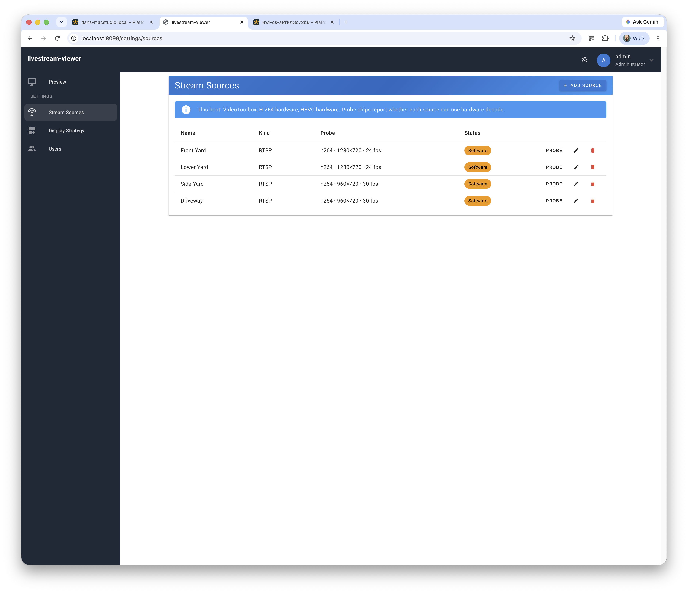
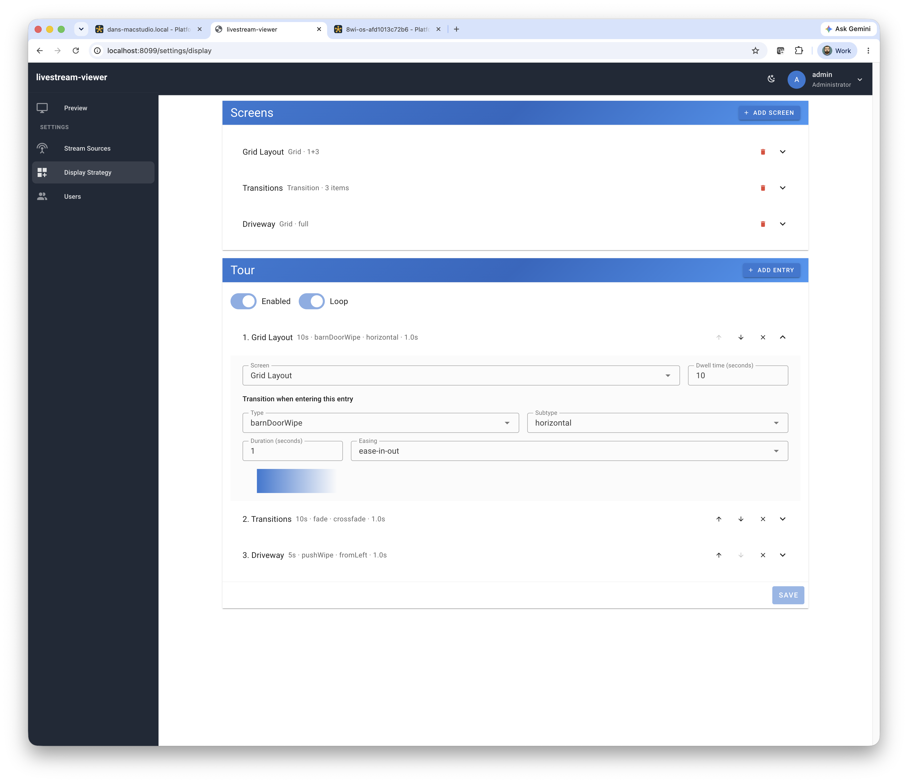
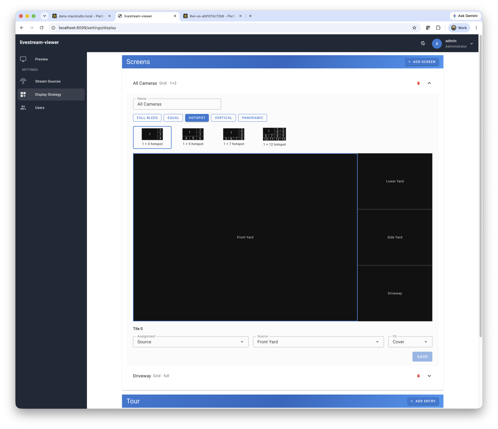
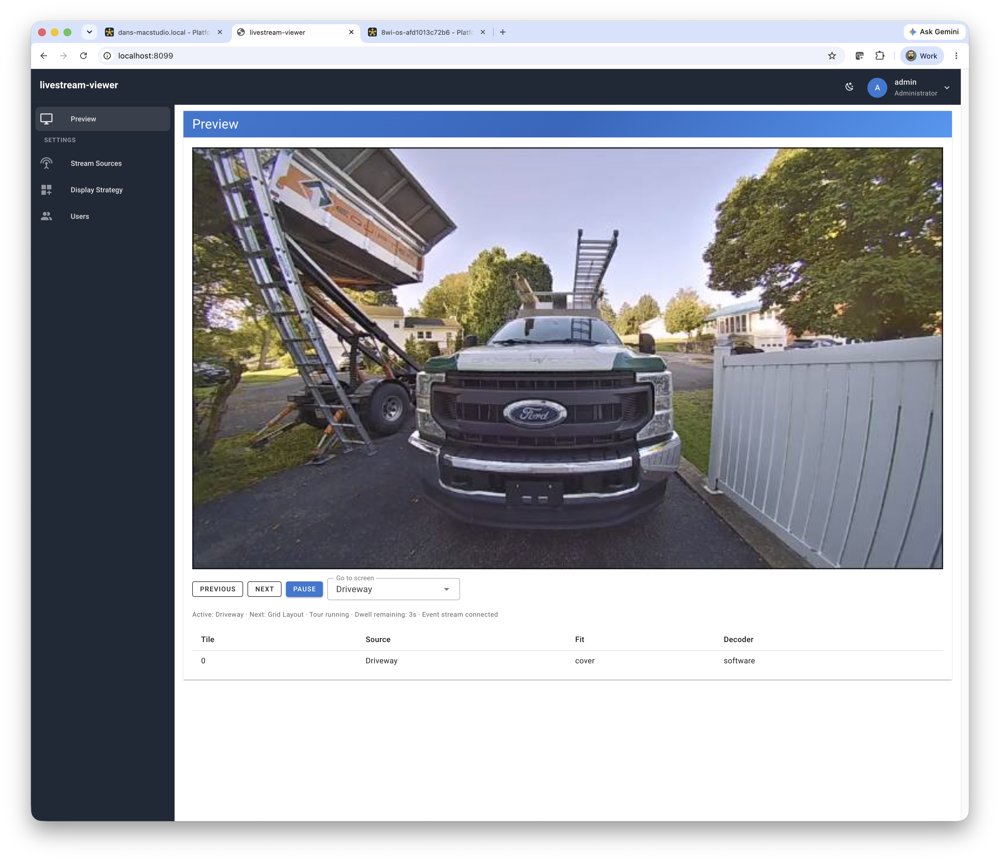

# livestream-viewer

A dedicated video wall for live streams — cameras, YouTube, and more — rendered natively to an attached display. No browser kiosk. No desktop session. Configure everything from a web UI, or run it as a Home Assistant add-on.



> **Ready to try.** Sources, layouts, tours, live preview, and windowed display output are implemented. Full-screen panel ownership on Linux is coded and awaiting real-hardware verification. See [docs/features/0004-ingest-and-display-engine.md](docs/features/0004-ingest-and-display-engine.md).

## Install (Home Assistant add-on)

This is the primary install path. In Home Assistant: **Settings** → **Add-ons** → **Add-on store** → **Repositories**, add `https://github.com/dchote/livestream-viewer`, then install **livestream-viewer**.

Supervisor pulls `ghcr.io/dchote/{arch}-addon-livestream-viewer` matching the add-on version. Those GHCR packages must be public. The image includes FFmpeg 8, SDL3, and YouTube support (`yt-dlp` + Deno). Details: [addon/README.md](addon/README.md).

## Why not a browser on a screen?

Pointing Chromium at a dashboard works until you want more than one stream, a clean cut between layouts, or decent performance on a Pi. Browsers rarely use the host’s video hardware the way you need, and a full desktop stack sits between your content and the panel.

**livestream-viewer** skips that path. It decodes with the hardware when available, composites on the GPU, and owns the display. A dense camera grid is the primary use case — not an afterthought.

## What you get

- **Native output** — Hardware-accelerated decode and compositing to an attached panel (or a development window on your Mac or Linux desktop)
- **Web management** — Add sources, build layouts, and run tours from a browser — no config files to hand-edit on the device
- **One binary** — API, UI, and display engine in a single process. Run it as a service, or install it as a Home Assistant add-on
- **Honest about hardware** — Each source reports whether it will decode on hardware or in software, so you know what a layout will cost before it drops frames

Works on Linux, macOS, and Windows for management. Display output targets Linux panels and desktop windows; Raspberry Pi and similar boards are first-class optimisation targets, not a hard requirement.

## Quick start (development)

```bash
source ./scripts/dev-env.sh   # macOS: points cgo at FFmpeg 8
./scripts/build.sh
./build/livestream-viewer -display=true
```

Open `http://127.0.0.1:8099` (first login `admin` / `admin`). Use `-display=false` if you only want the API and UI. Full dependency notes are in [docs/build-and-test.md](docs/build-and-test.md).

Linux `.deb` packages and binaries are a secondary path, published from the same add-on image via the manual **Release** GitHub Action (nFPM). See [docs/build-and-test.md](docs/build-and-test.md#releases).

## Features

### Bring your streams



- **YouTube live** — Resolved and kept fresh automatically. A local PO token provider (included in the Home Assistant add-on; on a Mac or `.deb` host, `auto` uses a sidecar on `127.0.0.1:4416` if one is running) plus a bundled yt-dlp plugin. If YouTube still treats the host as a bot, upload cookies from a browser that can play the stream. A standalone host also needs [`yt-dlp`](https://github.com/yt-dlp/yt-dlp) on `PATH`.
- **IP cameras and NVRs** — RTSP with TCP or UDP transport and credentials
- **Web and contribution feeds** — HLS, DASH, MPEG-TS, SRT, RTMP, and anything else FFmpeg can open
- **Uploaded files** — Loop for idle cards, station idents, and offline fallbacks
- **Automatic probing** — Codec, resolution, frame rate, and hardware vs software decode for every source

### Layouts that feel like a video wall



- **Grid screens** — Multiple sources at once: full-bleed, equal grids (`2x2`, `3x3`, `4x4`), hotspot layouts (`1+3`, `1+5`, `1+7`, …), plus vertical and panoramic variants. Per-tile fit and optional sequencing inside a tile.
- **Playlist screens** — One full-screen source at a time, with dwell times and transitions between items
- **Screen tours** — Step through whole screens on a timer, with a transition between each
- **Broadcast-style transitions** — Cut, fade, and a full wipe family (bar, box, barn door, iris, ellipse, clock, push, slide), with duration and easing



### See what the wall sees



The management UI includes a live **Preview** of the composited output, per-tile health, and manual tour controls — plus settings for sources, display strategy, and users. A documented REST API (Swagger at `/docs`) is available for automations and integrations.

## Built for constrained hosts

On a Raspberry Pi or similar board, decode capacity is often the limiting factor. livestream-viewer probes what the machine can actually do and surfaces it in the UI, so a busy grid tells you the cost up front instead of silently falling over.

Platform notes live in [docs/architecture/hardware-decode.md](docs/architecture/hardware-decode.md).

## Requirements

**To run (standalone):** a supported OS, FFmpeg 8.x libraries, and SDL3 3.4+ when display output is enabled. `yt-dlp` is required only for YouTube. The binary embeds the bgutil yt-dlp plugin. Linux `.deb` packages also ship Deno and the BgUtils PO token server (`auto` starts it). On a Mac, a sidecar on `127.0.0.1:4416` is used automatically when present. The Home Assistant add-on image already includes these.

**To build:** Go 1.25+ (CGO), Node.js 20+ and Yarn, FFmpeg 8.x headers, and SDL3. On macOS: `brew install ffmpeg@8 sdl3` then `source ./scripts/dev-env.sh`.

Details: [docs/build-and-test.md](docs/build-and-test.md).

## Documentation

- [Product Overview](docs/product-overview.md) — Vision, scope, and features
- [Technical Overview](docs/technical-overview.md) — Architecture and design decisions
- [Build and Test](docs/build-and-test.md) — Toolchain, CI, and releases
- [Architecture](docs/architecture/) — Display pipeline, ingest, hardware decode
- [Patterns](docs/patterns/) — Display strategy, render loop, frontend guide
- [Glossary](docs/reference/glossary.md) · [Features](docs/features/)

## License

MIT License — Copyright (c) 2026 Daniel Chote
